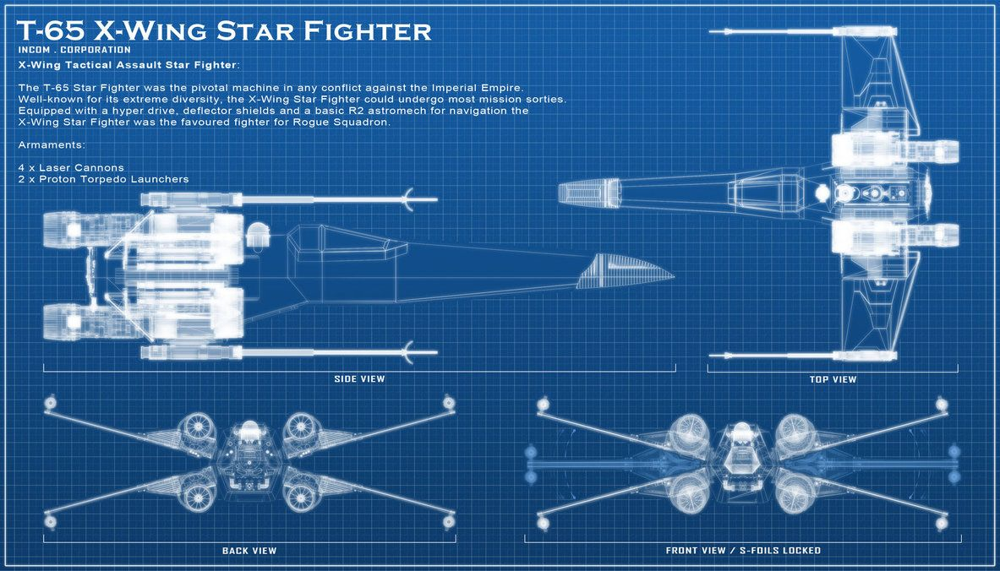

# X-wing

  

In this project I use Gatsby.js and styled components. I use a Star Wars type of feel just for getting ideas on how to mix patterns and thoughts that come to mind. I chose the X-wing Starfighter as a platform to divide into sections on one page. I puposefully left out any navbar or menu. Also this is my first time adding a video. The targeting computer section allows you to play and cast the video to a T.V.

Open [X-Wing](https://xwing-sauce.netlify.app/) to view it in your browser.

## 🧐 What's inside?

A quick look at the sections you'll see in this Gatsby project.

1.  **`Cannons:`**

2.  **`Schematics:`**

3.  **`Engines:`**

4.  **`Pilots:`**

5.  **`Astromech Droids:`**

6.  **`Sensors:`**

7.  **`Targeting Computer:`**

8.  **`Attack Position:`**

<h2 align="center">
  &copy; 2022 Michael Saucedo
</h2>
